# Remote Patient Monitoring System (RPMS)

## 📖 Overview
The **Remote Patient Monitoring System (RPMS)** is a Java-based desktop healthcare application that enables doctors to remotely monitor patient health and interact in real time.

### 👨‍⚕️ Core Capabilities:
- Upload and analyze patient vitals.
- Manage appointments and video consultations.
- Real-time one-to-one doctor-patient chat via Socket API.
- Medication effectiveness tracking and vitals visualization.
- Panic button and emergency alerts.
- Automatic appointment/medication reminders.
- Admin control for users, reports, and overall system.
---

## 🚀 Features

- ✅ Secure login for Patients, Doctors, and Admin
- ✅ Real-time chat (one-to-one) using Socket API
- ✅ Upload and analyze vitals via CSV
- ✅ Emergency alert system and panic button
- ✅ Appointment & medication reminders
- ✅ Video consultation request/approval with link sharing
- ✅ Vitals graphing and medication trend analysis
- ✅ Admin control of doctors, patients, and reports
- ✅ File-based data storage (no database required)

---
---

## 🗂️ Project Resources [🔗 Download Link]

📥 **Click below to access additional materials:**
- 📄 Project Report (PDF)
- 📘 User Manual
- 📊 Sample CSV Files
- 🖼️ Screenshots
- 🎥 Demo Videos

👉 **[Access Resources on Google Drive](https://drive.google.com/drive/folders/1T22mXzfrBG4SSWn3NQTwWVfYChzb0Qc2?usp=drive_link)**

---


## 📁 Project Structure
* RPMS/
* ├── src/
* │   └── main/
* │       └── java/
* │           ├── Chat/
* │           │   ├── ChatMessage.java
* │           │   ├── ChatServer.java  ✅ for Running chat need to run this
* │           │   ├── DoctorChatPanel.java
* │           │   ├── DoctorListRenderer.java
* │           │   └── PatientChatPanel.java
* │           ├── DashBoard/
* │           ├── Database/
* │           ├── Model/
* │           │   ├── Admin.java
* │           │   ├── Doctors.java
* │           │   ├── LoginSystem.java  ✅ Start point of the system (GUI Login)
* │           │   ├── Patients.java
* │           │   └── User.java
* │           ├── services/
* │           ├── utill/
* │           └── Main/

---

## 🛠️ How to Run the Project

### ✅ Requirements
- IntelliJ IDEA
- Java JDK 24
- Maven

### 🔧 Steps

1. **Open the project in IntelliJ.**
2. Make sure all Maven dependencies are downloaded (see `pom.xml` below).
3. Run the `ChatServer.java` to enable real-time chat:
4. {src/main/java/Chat/ChatServer.java}
5. Then run the main login system:
6. {src/main/java/Model/LoginSystem.java}

5. Use these test credentials to log in:
- 👤 **Patient**
    - Email: `asif@gmail.com`
    - Password: `as123`
- 🩺 **Doctor**
    - Email: `ali2023@gmail.com`
    - Password: `a123`
- 🛡️ **Admin**
    - Email: `mohammadh2020@gmail.com`
    - Password: `ad.123`

---

## 🧩 Dependencies (`pom.xml`)

Make sure your `pom.xml` contains the following:

```xml
<dependencies>
 <!-- Email -->
 <dependency>
     <groupId>com.sun.mail</groupId>
     <artifactId>jakarta.mail</artifactId>
     <version>2.0.1</version>
 </dependency>

 <!-- PDF -->
 <dependency>
     <groupId>com.itextpdf</groupId>
     <artifactId>itextpdf</artifactId>
     <version>5.5.13.2</version>
 </dependency>

 <!-- Charts -->
 <dependency>
     <groupId>org.jfree</groupId>
     <artifactId>jfreechart</artifactId>
     <version>1.5.3</version>
 </dependency>
</dependencies>
```
### Technologies Used
* Java 24 (JDK 24)
*
* Java Swing (GUI)
*
* Maven Project (pom.xml managed)
*
* Socket API (Chat Server/Client communication)
*
* File-based data persistence (UserFile/)
*
* JavaFX (Graphs, Reports)
*
* iText (PDF generation)
*
* Jakarta Mail (Reminders & notifications)
## Important Notes
#### ✅ Always start ChatServer before launching LoginSystem.

#### ✅ The system uses file-based data; make sure UserFile/ directory exists and has the right permissions.

#### ✅ Admin can manage all system entities and generate reports.
### Login System
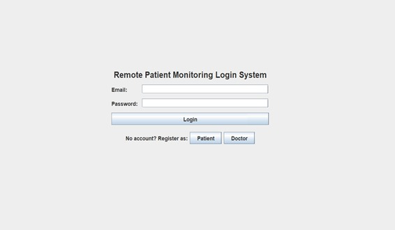
### 🧑‍⚕️ Patient Dashboard
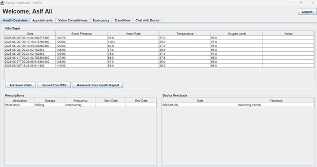
### 📅 Appointment View
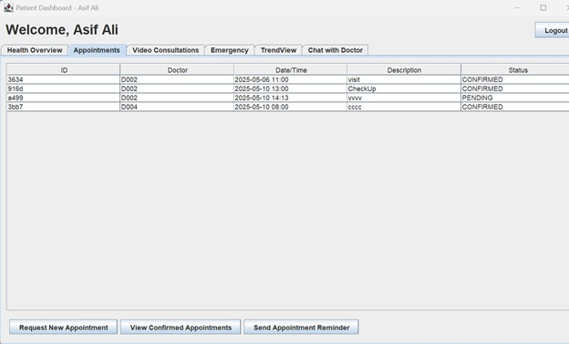
### 📹 Video Consultation

### 🚨 Emergency Alert Screen
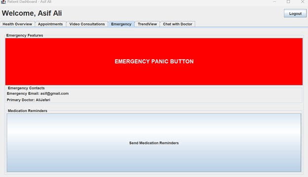
### 🚨 Health trend view 
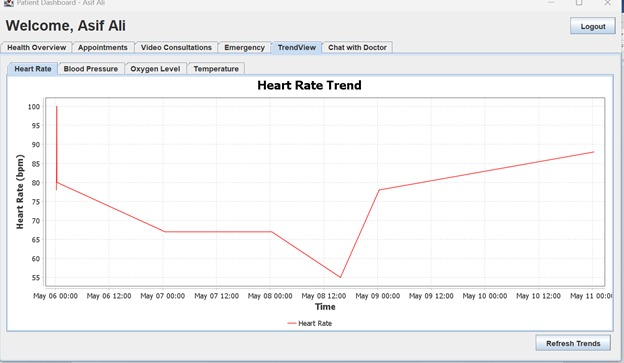
### 💬 Real-Time Chat with Doctor
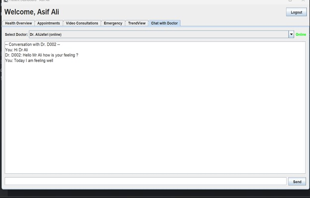
###  Doctor Dashboard
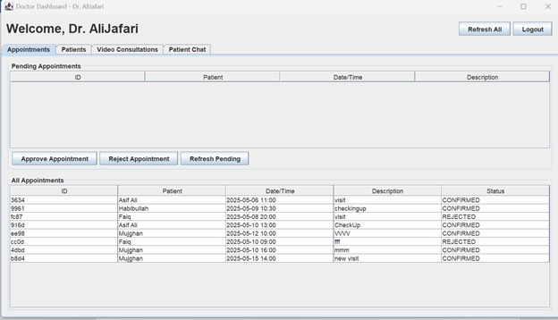
###  Doctor Dashboard patient section
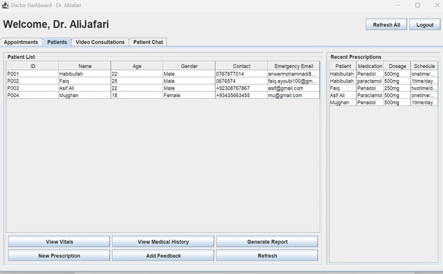
###  📹 Video Consultation Doctor Dashboard
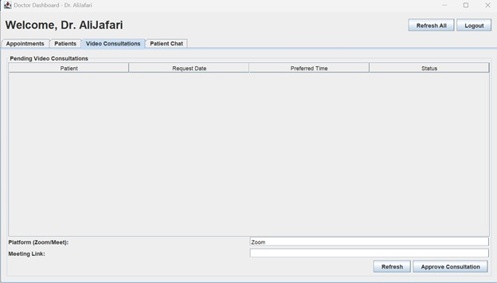
### 💬 Real-Time Chat with patient
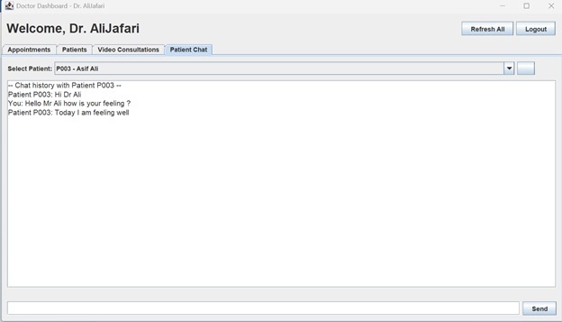
### Admin Dashboard
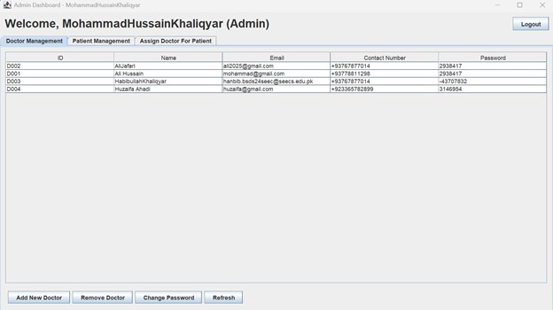
### Admin Dashboard Patient management
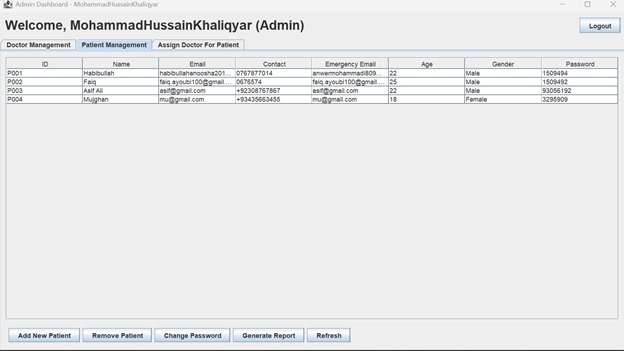
### Admin Dashboard Assign Doctor to patient
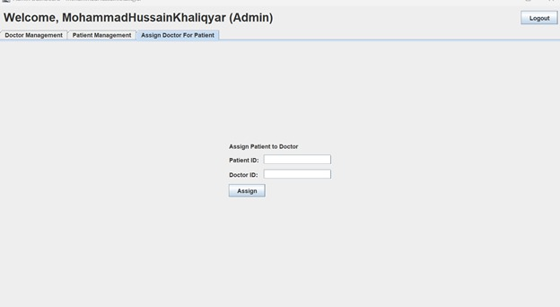
### Patient Report
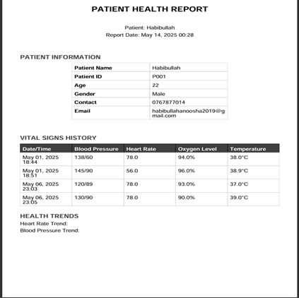

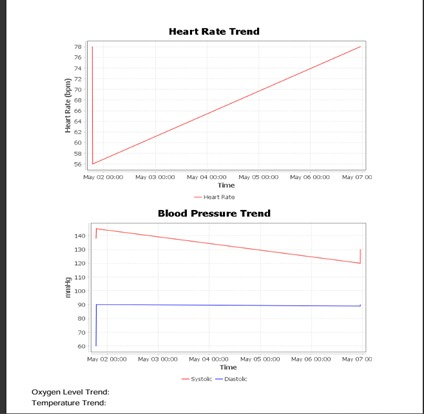

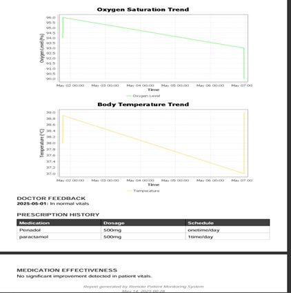


